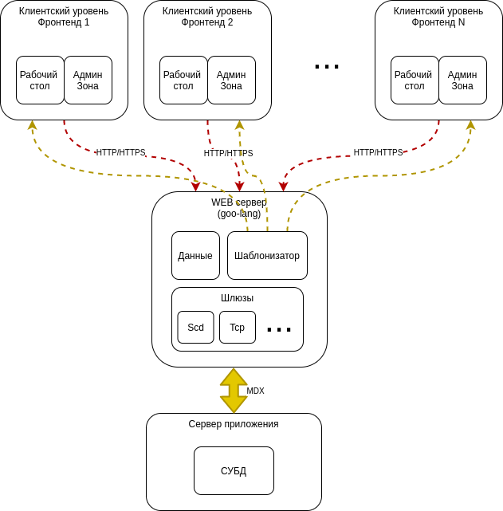

[...оглавление](./main.md)

Основными функциями приложения являются:

- Обеспечение конечного пользователя интерактивным представлением рабочих столов автоматизированных рабочих мест, сформированных мета-описаниями  в базе данных сервера приложения, наиболее популярными средствами просмотра WEB  страниц и в приложениях для мобильных устройств;

- Предоставление возможности конечному пользователю создавать на основе используемой модели данных собственных генераторов  отчетов и документов помимо тех, что содержатся в таблицах сервера приложения;
- Обеспечение многопользовательского авторизованного доступа к данным сервера приложения;
- Предоставление администраторам и системным конечного пользователя возможности  редактирования шаблонов представления данных и тонкой настройки корпоративных моделей представления данных;

В соответствии с принятой архитектурой приложения, наиболее рациональным вариантом реализации приложения для WEB доступа представляется трехзвенный (трехуровневый) вариант межпроцессорной архитектуры с использованием TCP/UDP соединений по уже используемому протоколу сервера приложений, и протоколу HTTP/HTTPS  с использованием JWT авторизации. 

Уровни системы должны иметь возможность вертикального масштабирования с целью увеличения производительности каждого компонента системы и повышения общей производительности в целом. Масштабируемость в этом контексте означает возможность заменять в существующей вычислительной системе компоненты более мощными и быстрыми по мере роста требований и развития технологий.

Должного уровня масштабирования предполагается достичь за счет использования принципа модульности в проектировании компонентов системы.

Клиент, или слой клиента, фронтенд WEB приложения — это интерфейсный компонент комплекса, предоставляемый конечному пользователю. Этот уровень не должен иметь:
- прямых связей с базой данных по требованиям безопасности и масштабируемости, 
- быть нагруженным основной бизнес-логикой по требованиям масштабируемости, 
- хранить состояние приложения по требованиям надёжности. 
На этот уровень должно выносится только простейшая бизнес-логика: 
- интерфейс авторизации, 
- алгоритмы шифрования, 
- проверка вводимых значений на допустимость и соответствие формату, 
- несложные операции с данными (сортировка, группировка, подсчёт значений), уже загруженными на терминал.
  

Для реализации фронтенда в базовом пакете целесообразно использовать современные мини-фреймворки типа Material Dashboard и нативные средства разработки, такие как HTML5 и JavaScript.
Сервер WEB приложений (средний слой, связующий слой),  бэкенд - представляет второй уровень, и на нём сосредоточена часть бизнес-логики, решающая следующие задачи:
- прием от фронтенда и выдача HTTP-ответа вместе с HTML-страницей, изображением, файлом, медиа-потоком или другими данными,
- многопользовательский доступ к данным сервера приложений (слоя данных) на базе его пользовательских политик, 
- реализация шаблонизатора для предоставления возможности чтения данных приложения бэкенда в динамически создаваемых страницах на основе шаблонов;
- Ведение журнала обращения клиентских фронтендов к ресурсам приложения.

Реализацию WEB сервера как отдельного приложения без привлечения ресурсов операционной системы необходимо провести с использованием сответствующих библиотек и модулей языка Go.

Сервер приложения, реализует основную бизнес-логику приложения и включает в себя слой данных, который обеспечивает хранение данных и выносится на отдельный уровень, реализуемый средствами систем управления базами данных, подключение к которому обеспечивается только с уровня сервера приложений. Вне его остаются только фрагменты, экспортируемые на фронтенд  (или терминалы), а также элементы логики, погруженные в базу данных (хранимые процедуры и триггеры). Реализация данного компонента обеспечивается уже имеющимся программным связующим программным обеспечением. 

Взаимодействие  с WEB сервером производится по протоколу MDX.

В простейших конфигурациях все компоненты или часть из них могут быть совмещены на одном вычислительном узле. 

