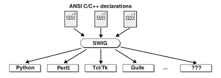

[...оглавление](./main.md)

Для реализации шлюзов взаимодействия WEB сервера с сервером приложения необходимо реализовать безопасные обертки для разделяемого кода библиотек, уже реализованных на c++. В частности, для протокола MDX - для библиотеки ScdMdx*. 

Для этих целей необходимо использовать SWIG - (англ. simplified wrapper and interface generator) — свободный инструмент для связывания программ и библиотек, написанных на языках C и C++, с интерпретируемыми (Tcl, Perl, Python, Ruby, PHP) или компилируемыми (Go, Java, C#, Scheme, OCaml) языками. Основная цель: обеспечить возможность вызова функций, написанных на одних языках, из кода на других языках. Для этого необходимо создать файл *.i с описанием экспортируемых функций. SWIG произведет генерацию исходного кода для склеивания C/C++ и языка Go, создаст исполняемый файл.

Вид исполняемого файла зависит от выбранного языка:
- исполняемый файл со встроенным интерпретатором скриптового языка;
- библиотека, функции C/C++ из которой автоматически становятся доступны из другого языка;
- библиотека функций C/C++ и библиотека функций — обёрток над функциями C/C++ (например, JNI для Java).

Движки скриптовых языков встраивают в программы на C/C++ по следующим причинам:
- скорость разработки с использованием скриптового языка выше, чем скорость разработки на C/C++;
- пользователи получают возможность автоматизации своих действий с по мощью сценариев. Например, в играх сценарии используются для написания сюжета и уровней;
- разработчики получают возможность автоматизации для тестирования ПО на этапе разработки. Готовое ПО может не включать скриптовый движок.

Причины создания библиотек функций C/C++, доступных интерпретаторам других языков:
- предоставление функциональности, отсутствующей в скриптовом языке;
- оптимизация наиболее часто выполняемых участков кода для повышения производительности (см. анализ производительности).

SWIG написан на языках С и C++, распространяется по лицензии, похожей на BSD, с февраля 1996 года. Лицензия SWIG *позволяет использовать, распространять и модифицировать код SWIG для коммерческих и некоммерческих целей практически без ограничений*.
